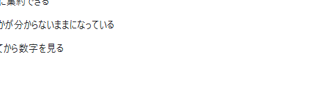
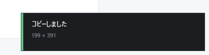
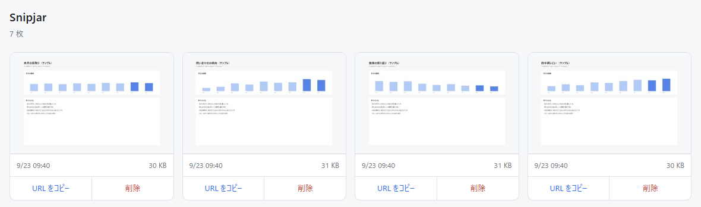

# Snipjar

Drag a region, choose **copy** or **save**. Your screenshots go into **your own**
Cloudflare R2 bucket and show up in a private gallery you can open from anywhere.

日本語版は [README.ja.md](README.ja.md)。

```
resident → click the pinned icon → the screen dims, crosshair cursor → drag
         → release, a small bar appears next to the selection
         → コピー (copy the image) or 保存 (save a PNG)
         → it also lands in your gallery
```





## Why another screenshot tool

Because nothing here runs on someone else's server. There is no account to make,
no free tier to outgrow, and no company holding your screenshots — the Worker and
the bucket are in your own Cloudflare account, deployed by you, and the author
never sees any of it. That also means there is nobody to shut it down.

## What it needs

- Windows 10 / 11
- A Cloudflare account with **R2 enabled** (free tier: 10 GB, card on file required)
- [Node.js](https://nodejs.org/) — only to run `wrangler`, the Cloudflare deploy tool

No .NET SDK. The client is built with the `csc.exe` that ships with Windows.

## Install

1. Download the latest zip from [Releases](https://github.com/ninose-uniz/snipjar/releases/latest)
   and unpack it somewhere.
2. Open PowerShell in that folder and run:

   ```powershell
   .\setup.ps1
   ```

   It logs you into Cloudflare, creates the R2 bucket, deploys the Worker, mints an
   upload token, writes the config and installs the client. It tells you what it is
   about to do before it touches your account.
3. Right-click **Snipjar** in the Start menu → **Pin to taskbar**.

### Windows will warn you about the exe

It will say *"Windows protected your PC"*. That is because this build is **not code
signed** — a certificate costs money every year and the warning does not go away
immediately even with one. Click **More info → Run anyway** if you are willing to.

If you would rather not take that on faith, check the hash against `SHA256SUMS.txt`
in the release:

```powershell
Get-FileHash .\snipjar.exe -Algorithm SHA256
```

Or skip the release entirely and build it yourself — `build.ps1` needs nothing but
Windows.

## Using it

| | |
|---|---|
| Click the pinned icon | the screen dims, drag out a region |
| `Esc` / right click / a tiny drag | cancel the selection |
| **コピー** or `C` | the image goes to the clipboard — paste it straight into Discord or Slack |
| **保存** or `S` | a PNG in `Pictures\snipjar\` |
| `Esc` / click away | throw the capture away. Nothing happens until you choose |

Both actions also upload to your bucket so the gallery stays a complete record.
The gallery lives at `https://snipjar.<your-subdomain>.workers.dev/gallery` — paste
the token once and it keeps you signed in with an HttpOnly cookie. Newest first,
with the URL and a delete button on every tile.

## Settings

`%APPDATA%\snipjar\config.ini`

```ini
endpoint=https://snipjar.<your-subdomain>.workers.dev/upload
token=<the same value as the Worker's UPLOAD_TOKEN>
upload=always      ; never = keep everything local, nothing is uploaded
savedir=           ; where 保存 writes. Default: Pictures\snipjar
updatecheck=       ; off = never contact GitHub
```

Restart the resident copy after editing:

```powershell
& "$env:LOCALAPPDATA\snipjar\snipjar.exe" --quit
Start-Process "$env:LOCALAPPDATA\snipjar\snipjar.exe" -ArgumentList '--background'
```

**Heads up:** on many machines `Pictures` resolves to `OneDrive\Pictures`, so saved
PNGs sync to OneDrive. Set `savedir` to a local path if you do not want that.

### What talks to the network

- Uploads go to your own Worker, nowhere else.
- Once a day the app asks `api.github.com` whether there is a newer release, and
  says so in a notification. It never downloads or installs anything on its own.
  `updatecheck=off` stops it.

## Command line

| | |
|---|---|
| `snipjar.exe` | start a selection (or make the resident copy start one) |
| `snipjar.exe --background` | just stay resident. Used by the logon entry |
| `snipjar.exe --quit` | stop the resident copy |
| `snipjar.exe --capture-full` | grab the whole primary screen and upload it |

## Uninstall

```powershell
.\install.ps1 -Uninstall
```

Removes the exe, the shortcut and the logon entry. Your config, your bucket and
your screenshots are left alone — delete the Worker and the bucket from the
Cloudflare dashboard when you want them gone.

## Built with

Cloudflare Workers + R2 for the server, C# / WinForms for the client, compiled by
the `csc.exe` already on every Windows machine. The whole thing is about 1,500
lines. See [README.ja.md](README.ja.md#作りの理由) for why it is put together the
way it is.

## License

[MIT](LICENSE)
